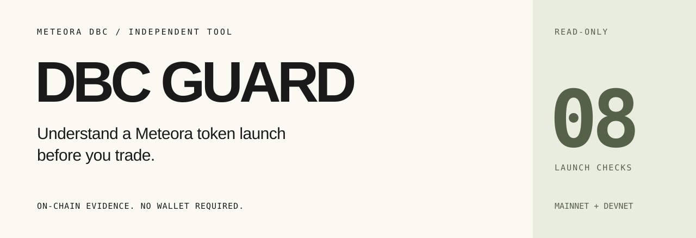
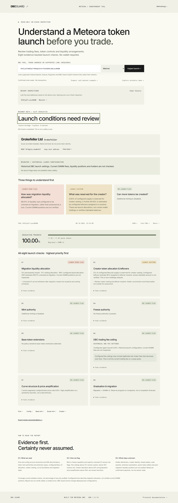

<div align="center">




**[Open DBC Guard ↗](https://dbc.whoim.space)** &nbsp; · &nbsp; [Pitch PDF](https://dbc.whoim.space/submission/dbc-guard-pitch.pdf) &nbsp; · &nbsp; [Editable PowerPoint](https://dbc.whoim.space/submission/dbc-guard-pitch.pptx)

</div>

## The launch behind the ticker

A token page shows a name and a price. It rarely makes launch conditions easy to understand: who can mint or freeze tokens, how fees are configured, where migration liquidity goes, and what is reserved for the creator.

DBC Guard brings those conditions into one readable report. Paste a Meteora DBC pool or token mint, see the most important findings first, then open the evidence behind each check.

**No wallet connection. No transactions. No safety score pretending to be a guarantee.**

<details>
<summary><strong>See the product — release 1.3.0 report preview</strong></summary>

<br>


Real mainnet report captured during release verification. A point-in-time example, not a token endorsement or a live quote.

</details>

## One report, three perspectives

| For | What becomes clearer |
| --- | --- |
| **Traders** | Token controls, launch fee ceilings and liquidity arrangements before a trade. |
| **Creators** | How their deployed launch configuration reads to someone discovering the token. |
| **Developers & launchpads** | Inspectable evidence and shareable reports for supported DBC launches. |

## Eight checks, explained

| Check | What DBC Guard examines |
| --- | --- |
| **Mint authority** | Whether additional base tokens can be minted and which authority controls supply. |
| **Freeze authority** | Whether an authority can freeze base-token accounts. |
| **Token extensions** | Extension types that may affect transfers or token controls. |
| **DBC fee ceiling** | The configured upper bound, including supported scheduler and dynamic-fee behavior. |
| **Migration liquidity** | Configured liquid, permanently locked and vesting allocations; estimated unlock timing. |
| **Creator allocation** | Configured creator vesting and estimated leftovers, not current wallet balances. |
| **Bonding curve** | Active curve structure and price-amplification heuristics. |
| **Graduation & migration** | Reserve progress, migration status and configured DAMM destination. |

Every check includes evidence. Missing evidence stays **unknown**. “8/8 checks completed” counts available checks; it is not a security score. Thresholds are documented in the [methodology](METHODOLOGY.md).

## From an address to an answer

1. **Paste a pool, token mint or supported link.** Choose Solana mainnet or devnet. Links include Solana Explorer addresses, Solscan token/account pages, Rugcheck token pages and DBC Guard reports.
2. **Read the three priority findings.** Optional names and tickers are issuer-provided labels; the mint address remains the identifier. Multiple validated pool matches require an explicit choice.
3. **Inspect, share or export.** Open account evidence, download provenance-rich JSON or a PNG card, and share a canonical pool link that runs a fresh inspection.

The last five successful live inspections stay **on your device** and can be cleared. Synthetic demos are labelled and excluded from history. Unsupported DEX pair links receive guidance rather than being treated as token mints.

## Try real mainnet examples

| Example | Open a fresh report |
| --- | --- |
| **Migrated launch** — historical DBC settings and migration allocation. | [Inspect reference pool ↗](https://dbc.whoim.space/?pool=8f6Zje37mKD3q1F46RqSo3thrPsScRQ9XLGNcsxzNSQW&network=mainnet-beta) |
| **Transfer-hook launch** — extension cautions and configured liquidity arrangements. | [Inspect transfer-hook pool ↗](https://dbc.whoim.space/?pool=BPsd85Aa4RZors38wanFbZauijj62Tfgx6VTtobzBqL8&network=mainnet-beta) |

These are genuine examples, not endorsements. Their on-chain state can change. [Read the timestamped case studies](submission/CASE-STUDIES.md).

## Run locally

Requires **Node.js 22.12+** and npm.

```sh
npm ci
npm run dev
```

Open [127.0.0.1:5173](http://127.0.0.1:5173). Optional server-side settings are listed in [.env.example](.env.example); public RPC endpoints can rate-limit requests.

```sh
npm test
npm run build
npm start
```

Production serves the frontend and API at `http://127.0.0.1:3001` by default. Release 1.3.0 passed **93 tests**, a production build and real-pool browser checks. See the [verification record](VERIFICATION.md) for the tested scope.

<details>
<summary><strong>Operator notes · environment, API and deployment</strong></summary>

### Environment

| Variable | Behavior |
| --- | --- |
| `HOST` / `PORT` | Defaults to `127.0.0.1:3001`. Use `HOST=0.0.0.0` only when required by container or proxy topology. |
| `MAINNET_RPC_URL` / `DEVNET_RPC_URL` | Server-only RPC endpoints. Never put credentials in `VITE_` variables. |
| `MAINNET_RPC_URLS` / `DEVNET_RPC_URLS` | Ordered comma/newline-separated fallbacks, deduplicated and capped at four. A nonempty list replaces the matching single URL. |
| `RPC_REQUESTS_PER_SECOND` | Optional positive pacing override, up to 100. Official public endpoints share a bounded 2-requests/second queue; private endpoints are unpaced by default. |

Keep `.env` out of Git and images. Users cannot supply arbitrary RPC URLs. Transient failures receive one retry per endpoint; invalid accounts do not. Individual reads have a 12-second body timeout and 1 MiB response bound, retry operations share a 45-second deadline, and inspection has an outer 50-second deadline with cancellation. Upstream quota exhaustion returns HTTP 429, not a finding about the pool. See [transport details](METHODOLOGY.md#input-resolution-and-transport--release-120).

### Read-only API

```text
GET /api/health
GET /api/inspect?address=POOL_OR_MINT&network=mainnet-beta
GET /api/token-info?address=MINT&network=mainnet-beta
```

Both data endpoints also support `network=devnet`. Optional token metadata is independent of inspection: unavailable names never block a report. The metadata endpoint validates on-chain account structure and never fetches issuer-provided URIs.

### Production

The [deployment guide](deploy/README.md) covers an isolated Node runtime, non-root systemd service, dedicated Nginx site and Certbot. Use HTTPS and a dedicated RPC for public operation. Express trusts only loopback proxy hops; different topologies require an explicit trust policy and appropriate ingress limits.

```sh
docker build -t dbc-guard .
docker run --rm -p 127.0.0.1:3001:3001 --env-file .env dbc-guard
```

Docker runtime commands require a Docker engine and are not part of the verified release runtime. `npm start` disables native addons as defense in depth; build with the normal Node runtime. See [SECURITY.md](SECURITY.md) for dependency remediation and compatibility boundaries.

</details>

## Built around Meteora

**React 19 + TypeScript + Vite** provide the interface. **Express + Solana Web3.js** handle bounded, server-side chain reads. **Meteora DBC SDK 1.5.13** is central to account decoding, pool PDA validation, fee math and liquidity-vesting estimates.

Supported account families are `virtualPool` / `poolConfig` and `transferHookPool` / `configWithTransferHook`. Pool ownership, layouts and derived addresses are validated before interpretation. Provider failures never become fabricated live reports.

## Know the boundaries

DBC Guard is an **independent launch-configuration inspection tool**, not a full security audit or an official Meteora product. No flagged issue establishes safety or predicts price.

Current post-migration DAMM positions and fees, holder concentration, linked wallets, creator identity, quote-token policy and extension parameter values are outside scope. Confirmed reads are sequential observations, not an atomic snapshot. Configured allocations are not proof of current holdings or withdrawable funds. Future account layouts and provider restrictions may prevent inspection.

## Explore further

- [Methodology](METHODOLOGY.md) · [Security](SECURITY.md) · [Release verification](VERIFICATION.md)
- [Deployment](deploy/README.md) · [Audit findings](audit/AUDIT-2026-10-08.md)
- [Submission materials](submission/SUBMISSION.md) · [Pitch PDF](https://dbc.whoim.space/submission/dbc-guard-pitch.pdf) · [Editable PowerPoint](https://dbc.whoim.space/submission/dbc-guard-pitch.pptx)
- [Real case studies](submission/CASE-STUDIES.md) · [User-validation plan](submission/USER-VALIDATION.md)

User interviews and a launchpad pilot are proposed research, not claimed adoption. DBC Guard does not execute trades or modify deployed pools.

---

<div align="center">

**Evidence first. Certainty never assumed.**

[Inspect a launch ↗](https://dbc.whoim.space)

</div>
